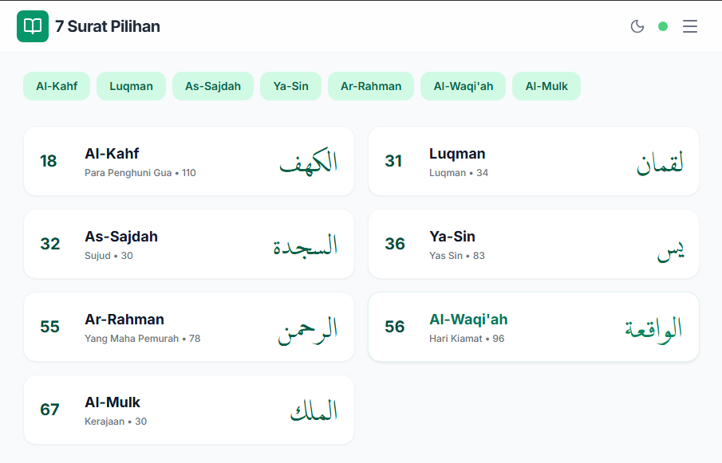

<div align="center">


# 7 Surat Pilihan

Aplikasi Al-Quran digital yang berfokus pada 7 surat pilihan (Al-Kahf, Luqman, As-Sajdah, Yasin, Ar-Rahman, Al-Waqi'ah, dan Al-Mulk) dengan fitur audio, terjemahan per kata, dan tafsir berbasis AI.

</div>

## ✨ Fitur Utama

- **7 Surat Pilihan**: Akses cepat ke surat-surat utama yang sering dibaca.
- **Audio Recitation**: Mendukung berbagai Qari (seperti Mishary Rashid Alafasy).
- **Word by Word**: Terjemahan dan transliterasi per kata untuk memudahkan pembelajaran.
- **AI Verse Insight**: Penjelasan mendalam (tafsir singkat) untuk setiap ayat menggunakan Google Gemini AI.
- **Offline Fallback**: Data lokal tersedia jika koneksi API terganggu.
- **Progressive Web App (PWA)**: Dapat diinstal di perangkat mobile dan desktop.

## 🛠️ Sumber API

Aplikasi ini menggunakan data dari sumber berikut:
1. **[Quran.com API v4](https://api.quran.com/api/v4)**: Digunakan untuk mengambil teks Arab, terjemahan, audio, dan data surat.

## 🚀 Cara Menjalankan Lokal

**Prasyarat:** Node.js (versi terbaru direkomendasikan)

1. **Clone Repository:**
   ```bash
   git clone https://github.com/abidbackupsept/7-surat-pilihan.git
   cd 7-surat-pilihan
   ```

2. **Install Dependensi:**
   ```bash
   npm install
   ```

3. **Jalankan Aplikasi:**
   ```bash
   npm run dev
   ```

## 📦 Teknologi yang Digunakan

- React 19
- Vite
- TypeScript
- Tailwind CSS
- Lucide React

---
Dibuat dengan ❤️ untuk memudahkan interaksi dengan Al-Quran.
